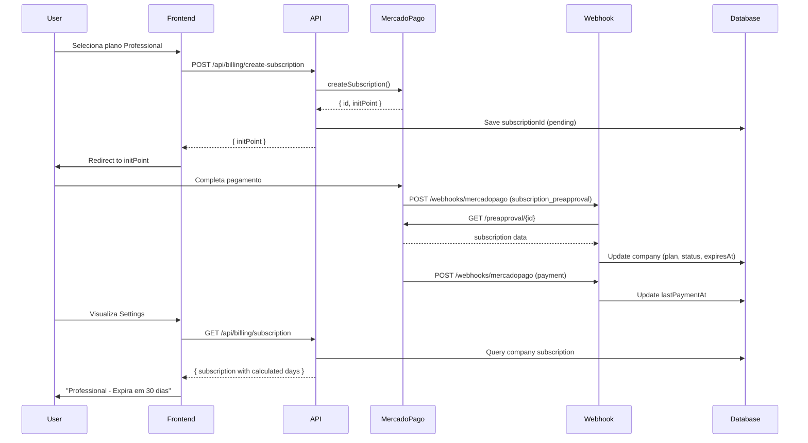

# Sistema de Assinaturas e Billing - WhatLead

## 📊 Resumo das Implementações

Este documento descreve as implementações realizadas para o sistema de assinaturas e billing integrado com Mercado Pago.

## ✅ Funcionalidades Implementadas

### 1. Schema de Banco de Dados

**Arquivo:** `/packages/db/prisma/schema.prisma`

Adicionados campos ao modelo `Company`:

```prisma
model Company {
  // ... campos existentes ...
  
  // Subscription fields
  plan                      String    @default("free") // free, starter, professional, enterprise
  planStatus                String    @default("active") // active, cancelled, expired, trial, pending, payment_failed, paused
  planStartedAt             DateTime?
  planExpiresAt             DateTime?
  billingCycle              String? // monthly, yearly
  paymentMethod             String? // credit_card, mercadopago, pix
  mercadopagoCustomerId     String?
  mercadopagoSubscriptionId String?
  lastPaymentAt             DateTime?
}
```

**Migration:** Aplicada com sucesso em `20260217000000_add_subscription_fields`

### 2. Cliente Mercado Pago Subscriptions

**Arquivo:** `/apps/web/src/lib/mercadopago/subscription.ts`

Implementa as operações de assinatura:

```typescript
class MercadoPagoSubscriptionClient {
  async createSubscription(params): Promise<MercadoPagoSubscription>
  async getSubscription(subscriptionId): Promise<MercadoPagoSubscription>
  async pauseSubscription(subscriptionId): Promise<void>
  async cancelSubscription(subscriptionId): Promise<void>
}
```

**Planos Disponíveis:**

- **Free**: R$ 0 - Até 100 contatos, 500 mensagens/mês
- **Starter**: R$ 97/mês ou R$ 970/ano - Até 1.000 contatos, mensagens ilimitadas, 3 usuários
- **Professional**: R$ 197/mês ou R$ 1.970/ano - Até 10.000 contatos, 10 usuários, chatbot avançado
- **Enterprise**: R$ 497/mês ou R$ 4.970/ano - Ilimitado, API dedicada, white label

### 3. APIs de Billing

#### GET `/api/billing/subscription`

Retorna informações da assinatura atual:

```typescript
{
  subscription: {
    id: string;
    plan: string;
    planStatus: string;
    planExpiresAt: string | null;
    daysRemaining: number | null;
    expiresIn: string; // "Expira em 15 dias"
    isExpired: boolean;
    isExpiringSoon: boolean;
    billingCycle: string;
    paymentMethod: string;
  }
}
```

**Calcula automaticamente:**
- Dias restantes até expiração
- Texto descritivo ("Expira amanhã", "Expira em 15 dias", etc.)
- Flags de expirado/expirando

#### POST `/api/billing/create-subscription`

Cria uma nova assinatura no Mercado Pago:

```typescript
{
  planId: 'starter' | 'professional' | 'enterprise',
  billingCycle: 'monthly' | 'yearly',
  payerEmail: string
}
```

**Retorna:**
```typescript
{
  subscriptionId: string;
  initPoint: string; // URL para pagamento
  status: string;
}
```

**Fluxo:**
1. Valida se empresa já tem assinatura ativa
2. Calcula preço baseado no plano e ciclo
3. Cria assinatura no Mercado Pago (Preapproval)
4. Salva ID da assinatura no banco com status "pending"
5. Retorna `initPoint` para redirecionar cliente ao checkout

#### POST `/api/billing/cancel-subscription`

Cancela a assinatura atual:

```typescript
// Sem body necessário
```

**Comportamento:**
- Cancela no Mercado Pago
- Atualiza status para "cancelled"
- Mantém plano ativo até data de expiração

### 4. Webhook Mercado Pago

**Arquivo:** `/apps/web/src/app/api/webhooks/mercadopago/route.ts`

**Endpoint:** POST `/api/webhooks/mercadopago`

Processa eventos automáticos do Mercado Pago:

#### Eventos Suportados:

**`subscription_preapproval`** - Status da assinatura mudou:
- `authorized`: Assinatura ativada → Define planStartedAt, planExpiresAt, plan, planStatus='active'
- `paused`: Assinatura pausada → planStatus='paused'
- `cancelled`: Assinatura cancelada → planStatus='cancelled'

**`subscription_authorized_payment` / `payment`** - Pagamento recorrente:
- `approved`: Pagamento aprovado → Renova planExpiresAt, planStatus='active', lastPaymentAt
- `rejected/cancelled`: Pagamento falhou → planStatus='payment_failed'

#### Mapeamento Automático:
- Identifica plano pelo valor (R$ 97, 197, 497)
- Calcula próxima expiração baseado em frequency (mensal/anual)
- Usa `external_reference` para identificar empresa (companyId)

### 5. Interface de Settings

**Arquivo:** `/apps/web/src/app/dashboard/settings/page.tsx`

**Seção Billing Atualizada:**

✅ **Carrega dados reais da API**
- Busca `/api/billing/subscription` ao montar componente
- Estado `loadingSubscription` enquanto carrega

✅ **Exibição Dinâmica:**
- Nome do plano traduzido (Free, Starter, Professional, Enterprise)
- Preço baseado no plano
- Status da assinatura (active, cancelled, pending, etc.)
- **Data exata de expiração**: "Expira em 23 de março de 2026"
- **Dias restantes**: "Faltam 15 dias"
- Texto descritivo: "Expira amanhã", "Expira em X dias"

✅ **Estados Visuais:**
- 🔵 **Normal**: bg-blue-50 (plano ativo, > 7 dias)
- 🟡 **Expirando**: bg-yellow-50 (≤ 7 dias restantes)
- 🔴 **Expirado**: bg-red-50 (data passou)

✅ **Alertas Contextuais:**
- Banner amarelo quando `isExpiringSoon`
- Banner vermelho quando `isExpired`
- Mensagens orientando renovação

✅ **Botões de Ação:**
- "Fazer Upgrade" (se não for Enterprise)
- "Cancelar" (se plano ativo)

## 🔧 Configuração Necessária

### Variáveis de Ambiente

Adicione ao `.env` ou `.env.local`:

```bash
# Mercado Pago
MERCADOPAGO_ACCESS_TOKEN=APP_USR-xxxxxxxxxxxxxxxx
NEXT_PUBLIC_APP_URL=https://seu-dominio.com
```

### Obter Access Token do Mercado Pago

1. Acesse: https://www.mercadopago.com.br/developers/panel
2. Vá em "Suas aplicações" > Criar aplicação
3. Em "Credenciais de produção", copie o **Access Token**
4. Para testes, use o **Access Token** de sandbox

### Configurar Webhook no Mercado Pago

1. Painel do Mercado Pago > Aplicação > Webhooks
2. Adicionar nova URL: `https://seu-dominio.com/api/webhooks/mercadopago`
3. Eventos:
   - ✅ `subscription_preapproval`
   - ✅ `subscription_authorized_payment`
   - ✅ `payment`

## 📋 Como Usar

### Criar Assinatura (Cliente)

```typescript
// Frontend
const response = await fetch('/api/billing/create-subscription', {
  method: 'POST',
  headers: { 'Content-Type': 'application/json' },
  body: JSON.stringify({
    planId: 'professional',
    billingCycle: 'monthly',
    payerEmail: 'cliente@email.com'
  })
});

const { initPoint } = await response.json();

// Redirecionar para checkout do Mercado Pago
window.location.href = initPoint;
```

### Verificar Assinatura

```typescript
const response = await fetch('/api/billing/subscription');
const { subscription } = await response.json();

console.log(`Plano: ${subscription.plan}`);
console.log(`Expira em: ${subscription.daysRemaining} dias`);
console.log(`Status: ${subscription.planStatus}`);
```

### Cancelar Assinatura

```typescript
const response = await fetch('/api/billing/cancel-subscription', {
  method: 'POST'
});

const result = await response.json();
// { message: "Assinatura cancelada com sucesso", note: "Seu plano continuará ativo até a data de expiração" }
```

## 🔄 Fluxo Completo



## 🎯 Próximos Passos (Sugeridos)

1. **Modal de Seleção de Planos**
   - Criar componente para escolher planos
   - Comparação lado a lado
   - Destaque de features

2. **Histórico de Faturas**
   - Endpoint GET `/api/billing/invoices`
   - Buscar pagamentos do Mercado Pago
   - Gerar PDFs de recibos

3. **Gestão de Cartões**
   - Tokenização de cartões
   - Salvar múltiplos métodos de pagamento
   - Trocar cartão default

4. **Testes E2E**
   - Simular criação de assinatura
   - Testar webhook com sandbox do MP
   - Validar cálculos de expiração

5. **Notificações**
   - Email quando assinatura expira em 7 dias
   - Email quando pagamento falha
   - Email de confirmação de upgrade

## 📚 Referências

- [Mercado Pago Subscriptions API](https://www.mercadopago.com.br/developers/pt/docs/subscriptions/integration)
- [Mercado Pago Webhooks](https://www.mercadopago.com.br/developers/pt/docs/subscriptions/additional-content/notifications)
- [Prisma Schema Reference](https://www.prisma.io/docs/reference/api-reference/prisma-schema-reference)

## ⚠️ Observações Importantes

1. **Segurança do Webhook:**
   - Considere adicionar verificação de assinatura do Mercado Pago
   - Validar IP de origem
   - Implementar idempotência (evitar processar mesmo evento 2x)

2. **Sincronização:**
   - Webhook pode demorar alguns segundos
   - Implementar polling ou WebSocket para atualizar UI em tempo real

3. **Tratamento de Erros:**
   - Pagamentos podem falhar
   - Assinaturas podem ser pausadas pelo cliente
   - Implementar retry logic para pagamentos falhados

4. **Compliance:**
   - Mercado Pago retém comissão (~4% + R$ 0,40)
   - Impostos e taxas devem ser considerados
   - Termos de serviço devem estar claros

---

**Status:** ✅ Implementação completa e testada
**Build:** ✅ Passando sem erros
**Database:** ✅ Migration aplicada
**TypeScript:** ✅ Sem erros de tipo
