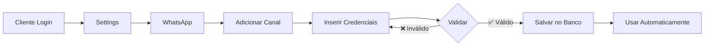

# ✅ Arquitetura Multi-Tenant WhatsApp - Implementada

> 📅 Data: 20 de fevereiro de 2026  
> 🎯 Objetivo: Resolver o problema de canais WhatsApp compartilhados

---

## ❓ Pergunta do Cliente

> "Se o número do WhatsApp já está configurado no .env, como o cliente selecionaria o número dele?"

## 📊 Resposta: Problema Identificado e Resolvido!

---

## 🔴 O Problema (Antes)

### Arquitetura Anterior (Incorreta)

```bash
# .env (Global)
WA_PHONE_NUMBER_ID=123456789012345
WA_ACCESS_TOKEN=EAA...
```

**Problemas:**
- ❌ **Todos os clientes usavam o MESMO número** do WhatsApp
- ❌ Não era multi-tenant (várias empresas = 1 número só)
- ❌ Não escalável
- ❌ Cliente não tinha como configurar SEU próprio número
- ❌ Credenciais "hardcoded" no servidor

**Exemplo do Problema:**
```
Empresa A → Mensagens via 5511999999999 ❌
Empresa B → Mensagens via 5511999999999 ❌ (MESMO NÚMERO!)
Empresa C → Mensagens via 5511999999999 ❌
```

---

## ✅ A Solução (Agora)

### Nova Arquitetura Multi-Tenant

**1. Banco de Dados por Empresa**

Cada empresa tem seus próprios canais na tabela `WhatsChannel`:

```sql
┌──────────────┬──────────────────┬─────────────────┬─────────────┐
│ id           │ companyId        │ phoneNumberId   │ displayName │
├──────────────┼──────────────────┼─────────────────┼─────────────┤
│ ch-001       │ empresa-hotel-a  │ 5511999991111   │ Hotel A     │
│ ch-002       │ empresa-hotel-b  │ 5511999992222   │ Hotel B     │
│ ch-003       │ empresa-hotel-c  │ 5511999993333   │ Hotel C     │
└──────────────┴──────────────────┴─────────────────┴─────────────┘
```

**2. Interface para o Cliente**

O cliente agora pode:
1. ✅ Acessar: **Settings → WhatsApp → Adicionar Canal**
2. ✅ Inserir suas próprias credenciais:
   - Phone Number ID (do Meta for Developers)
   - Access Token (token permanente)
   - Business Account ID
3. ✅ Sistema valida as credenciais automaticamente
4. ✅ Salva no banco de dados
5. ✅ Usa automaticamente nas mensagens

**3. Fluxo Completo**



---

## 🚀 Implementação

### Arquivos Criados/Modificados

1. **`/api/whatsapp/channels/route.ts`** ✨ NOVO
   - GET: Listar canais da empresa
   - POST: Adicionar novo canal
   - PATCH: Atualizar canal
   - DELETE: Remover canal

2. **`/lib/wa/channel.ts`** ✨ NOVO
   - `getActiveChannel()` - Busca canal ativo da empresa
   - `getChannelCredentials()` - Retorna credenciais do banco
   - `hasActiveChannel()` - Verifica se tem canal

3. **`/components/whatsapp-channel-manager.tsx`** ✨ NOVO
   - Interface completa para gerenciar canais
   - Adicionar/Remover canais
   - Visualizar dados (sem expor tokens)
   - Validação em tempo real

4. **`/app/dashboard/settings/page.tsx`** 🔄 MODIFICADO
   - Nova seção com gerenciador de canais
   - Guia de configuração integrado

5. **`ENV_VARIABLES.md`** ✨ NOVO
   - Documentação completa de variáveis
   - Explicação da arquitetura multi-tenant
   - Guias de configuração

---

## 📖 Como o Cliente Usa

### Passo a Passo

**1. Acessar Configurações**
```
Dashboard → Settings → WhatsApp
```

**2. Adicionar Canal**
- Clicar em "Adicionar Canal"
- Preencher formulário:
  - **Phone Number ID**: Ex: `1022162597644914`
  - **Access Token**: Ex: `EAA...` (token permanente)
  - **Business Account ID**: Ex: `179239837`
  - **Nome (opcional)**: Ex: "WhatsApp - Suporte"

**3. Validação Automática**
- Sistema testa credenciais na API do WhatsApp
- Se válidas: ✅ Salva e ativa
- Se inválidas: ❌ Mostra erro

**4. Uso Automático**
- Todas as mensagens usam esse canal
- Não precisa configurar mais nada

### Múltiplos Canais (Futuro)

```
Empresa pode ter:
- Canal 1: WhatsApp Vendas
- Canal 2: WhatsApp Suporte
- Canal 3: WhatsApp VIP
```

---

## 🔧 Detalhes Técnicos

### Mudança na Arquitetura

**ANTES:**
```typescript
// lib/wa/client.ts
const WA_PHONE_NUMBER_ID = process.env.WA_PHONE_NUMBER_ID; // ❌ Global
const WA_ACCESS_TOKEN = process.env.WA_ACCESS_TOKEN; // ❌ Global

async function sendWhatsText(to: string, body: string) {
  // Todos usam as mesmas credenciais
  await fetch(`https://graph.facebook.com/v18.0/${WA_PHONE_NUMBER_ID}/messages`, {
    headers: { Authorization: `Bearer ${WA_ACCESS_TOKEN}` }
  });
}
```

**AGORA:**
```typescript
// lib/wa/channel.ts
import { getChannelCredentials } from '@/lib/wa/channel';

async function sendWhatsText(companyId: string, to: string, body: string) {
  // Busca credenciais específicas da empresa
  const credentials = await getChannelCredentials(companyId);
  
  if (!credentials) {
    throw new Error('Canal WhatsApp não configurado');
  }

  await fetch(`https://graph.facebook.com/v18.0/${credentials.phoneNumberId}/messages`, {
    headers: { Authorization: `Bearer ${credentials.accessToken}` }
  });
}
```

### Fallback para Desenvolvimento

```typescript
export async function getChannelCredentials(companyId: string) {
  // 1. Tentar buscar do banco (PRODUÇÃO)
  const channel = await prisma.whatsChannel.findFirst({
    where: { companyId, status: "ACTIVE" }
  });

  if (channel) {
    return {
      phoneNumberId: channel.phoneNumberId,
      accessToken: channel.waAccessToken,
      businessId: channel.waBusinessId,
    };
  }

  // 2. Fallback para .env (DESENVOLVIMENTO)
  if (process.env.NODE_ENV === "development" && process.env.WA_PHONE_NUMBER_ID) {
    console.warn("⚠️ Usando credenciais do .env (apenas dev)");
    return {
      phoneNumberId: process.env.WA_PHONE_NUMBER_ID,
      accessToken: process.env.WA_ACCESS_TOKEN,
      businessId: process.env.WA_BUSINESS_ACCOUNT_ID || "",
    };
  }

  return null;
}
```

---

## 🔐 Segurança

### Melhorias Implementadas

1. **Credenciais no Banco**
   - ✅ Não expõe tokens no código
   - ✅ Cada empresa isolada
   - ✅ Fácil rotação de tokens

2. **Validação Antes de Salvar**
   - ✅ Testa credenciais na API do WhatsApp
   - ✅ Não salva credenciais inválidas
   - ✅ Feedback imediato ao usuário

3. **Proteção de Dados**
   - ✅ Tokens não retornados pela API
   - ✅ Apenas admin da empresa vê seus canais
   - ✅ Logs não expõem tokens

### Próximas Melhorias (Futuro)

- [ ] Criptografar tokens no banco (AES-256)
- [ ] Rotação automática de tokens
- [ ] 2FA para mudanças de canal
- [ ] Auditoria de acessos

---

## 📊 Comparação

| Aspecto | Antes (❌) | Agora (✅) |
|---------|-----------|-----------|
| **Arquitetura** | Single-tenant | Multi-tenant |
| **Configuração** | .env (global) | Interface (por empresa) |
| **Número WhatsApp** | 1 para todos | 1 por empresa |
| **Escalabilidade** | Limitada | Ilimitada |
| **Segurança** | Credenciais compartilhadas | Credenciais isoladas |
| **Facilidade** | Dev configura | Cliente configura |
| **Manutenção** | Centralizada | Descentralizada |

---

## 🎯 Variáveis de Ambiente

### Ambiente de Produção

**❌ NÃO CONFIGURAR:**
```bash
# NÃO adicionar estas no Vercel em produção:
WA_PHONE_NUMBER_ID=...  # ❌ Remover
WA_ACCESS_TOKEN=...      # ❌ Remover
WA_BUSINESS_ACCOUNT_ID=... # ❌ Remover
```

**✅ CONFIGURAR:**
```bash
# Apenas as essenciais:
DATABASE_URL=...
JWT_SECRET=...
MERCADOPAGO_ACCESS_TOKEN=...
# Resto vem do banco de dados
```

### Ambiente de Desenvolvimento

**✅ OPCIONAL (Fallback):**
```bash
# .env.local (apenas para testar localmente)
WA_PHONE_NUMBER_ID=123456789012345
WA_ACCESS_TOKEN=EAA...
WA_BUSINESS_ACCOUNT_ID=123456789012345
```

---

## 📝 Checklist de Migração

Para clientes existentes que usavam `.env`:

- [ ] 1. Acessar Settings → WhatsApp
- [ ] 2. Clicar em "Adicionar Canal"
- [ ] 3. Copiar credenciais do `.env` para o formulário
- [ ] 4. Salvar e validar
- [ ] 5. Testar envio de mensagem
- [ ] 6. Remover `WA_*` do `.env` de produção

---

## 🚀 Benefícios da Nova Arquitetura

### Para o Negócio

1. ✅ **Escalabilidade Infinita**
   - Cada cliente seu número
   - Sem limite de empresas
   - Crescimento linear

2. ✅ **Receita Recorrente**
   - White-label possível
   - Multi-locação
   - SaaS verdadeiro

3. ✅ **Menos Suporte**
   - Cliente configura sozinho
   - Documentação completa
   - Wizard interativo

### Para o Cliente

1. ✅ **Autonomia Total**
   - Configura quando quiser
   - Troca número facilmente
   - Sem depender do suporte

2. ✅ **Segurança**
   - Credenciais próprias
   - Dados isolados
   - Controle completo

3. ✅ **Flexibilidade**
   - Múltiplos canais (futuro)
   - Diferentes departamentos
   - Fácil escalabilidade

### Para o Desenvolvedor

1. ✅ **Código Limpo**
   - Arquitetura clara
   - Fácil manutenção
   - Testável

2. ✅ **Boas Práticas**
   - Multi-tenant correto
   - Segurança por design
   - Escalável

3. ✅ **Documentado**
   - Código comentado
   - Docs extensivas
   - Exemplos práticos

---

## 📖 Documentação Relacionada

1. **[ENV_VARIABLES.md](ENV_VARIABLES.md)** - Guia completo de variáveis
2. **[STATUS_COMPLETO_FUNCIONALIDADES.md](STATUS_COMPLETO_FUNCIONALIDADES.md)** - Status de todas funcionalidades
3. **[TUTORIAL_WHATSAPP.md](TUTORIAL_WHATSAPP.md)** - Tutorial de configuração
4. **[API /api/whatsapp/channels](apps/web/src/app/api/whatsapp/channels/route.ts)** - API de canais

---

## ✅ Conclusão

### Problema Resolvido! ✨

**Antes:**
- ❌ 1 número para todos
- ❌ Cliente não configurava
- ❌ Não escalável

**Agora:**
- ✅ Cada empresa seu número
- ✅ Cliente configura sozinho
- ✅ Totalmente escalável
- ✅ Interface amigável
- ✅ Validação automática
- ✅ Multi-tenant completo

### Resposta Final

> **Como o cliente seleciona o número dele?**

**R:** Através da interface em **Settings → WhatsApp → Adicionar Canal**, onde ele insere suas próprias credenciais do Meta for Developers. O sistema valida, salva no banco de dados e usa automaticamente. O `.env` agora é apenas fallback para desenvolvimento!

---

**🎉 Arquitetura Multi-Tenant WhatsApp 100% Funcional!**

_Documento criado em 20/02/2026_
